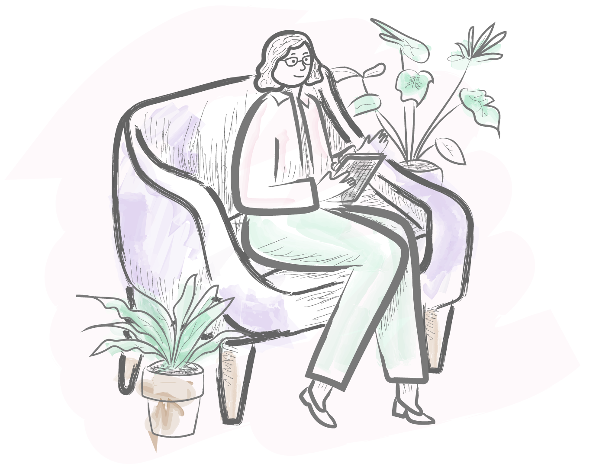

<div align="center">
  
  
  <h1>Somos Mente y Cuerpo (SMC)</h1>
  
  <p><b>Plataforma web profesional para un equipo interdisciplinario especializado en TCA y Salud Mental.</b></p>

  <a href="https://somosmenteycuerpo.com/">
    
  </a>

  <br><br>

  
  
  
  
  
</div>

---

## 📋 Sobre el Proyecto

**Somos Mente y Cuerpo** es un centro con sede en Buenos Aires dedicado al tratamiento integral de los Trastornos de la Conducta Alimentaria. Este proyecto web fue desarrollado para proporcionar un acceso claro a servicios de psicología, psiquiatría y nutrición, además de ofrecer formación profesional en terapias basadas en la evidencia.

### 🎯 Objetivos
- **Visibilidad Profesional:** Presentar al equipo interdisciplinario y su formación académica.
- **Canal de Contacto:** Agilizar el triaje de pacientes mediante integración directa con WhatsApp.
- **Educación:** Facilitar un catálogo de webinars y cursos para profesionales de la salud.

---

## 🛠️ Stack Tecnológico e Implementación

Para asegurar la máxima velocidad de carga y un mantenimiento limpio, se optó por un desarrollo **Vanilla**:

- **Frontend:** HTML5 semántico y CSS3 con metodología de diseño responsive (Mobile-first).
- **Lógica de Interfaz:** Vanilla JavaScript para el manejo de DOM, menús desplegables y animaciones.
- **Animaciones:** Implementación de `Intersection Observer API` para efectos de fade-in eficientes al hacer scroll.
- **Despliegue:** Alojado en infraestructura de **DonWeb/Ferozo**.

---

## 🖼️ Vista del Diseño

<div align="center">
  
  <p><i>Interfaz diseñada para transmitir calma y profesionalismo mediante una paleta de colores suaves.</i></p>
</div>

---

## 📂 Estructura del Repositorio

```bash
├── assets/           # Recursos visuales, iconos y tipografías locales
├── index.html        # Estructura principal y secciones (Equipo, Formación, Contacto)
├── style.css         # Estilos globales, variables de color y media queries
└── script.js         # Lógica de animaciones, scroll y menú móvil
